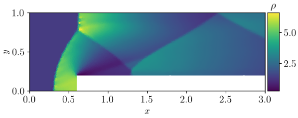

# JAX-FVM
JAX-FVM is a differentiable finite volume method for unstructured meshes based on [JAX](https://github.com/jax-ml/jax). 

The equations are the 2D Euler equations, the 2D compressible NS equations. A script is also given as a 2D Fourier-Galerkin solver for the incompressible NS equations. 

## Documentation
Small examples are given in the examples folder. 

## Key features
JAX-FVM is Automatic Differentiation (AD) + Finite Volume Method (FVM)
- Unstructured meshes with 2D triangle elements
- First and second order methods for both Euler and compressible NS equations
- (in process), read and write vtk files

## Examples
Example concerning the forward facing step case, 

## License
This project is licensed under the GNU General Public License v3 - see the LICENSE for details. For commercial use, contact Guillaume de Romémont (guillaume at romemont dot protonmail dot com)

## Dependencies
The project is built using :
- jax-12 for GPUs
- [Meshpy](https://github.com/inducer/meshpy)
- [Meshio](https://github.com/nschloe/meshio)

